# RockAuto - Cloud and Edge Infrastructure Platform (AWS)

A production-grade cloud-native infrastructure platform supporting distributed edge and centralized cloud workloads on AWS. Built with Kubernetes, GitOps, zero-trust security, and Infrastructure as Code.

---

## Technology Stack

### Infrastructure & Cloud Services (AWS)

| Technology | Function in This Project |
|-----------|--------------------------|
| **Amazon EKS** | Managed Kubernetes control plane for running all cloud workloads |
| **Amazon EC2 (t3.medium)** | Worker nodes for EKS cluster (managed node groups) |
| **Amazon EC2 (t3.small)** | Edge site simulation running k3s lightweight Kubernetes |
| **Amazon VPC** | Network isolation — separate VPCs for cloud platform and edge site |
| **Amazon ECR** | Private container registry for storing and scanning Docker images |
| **AWS KMS** | Encryption at rest for EKS secrets (etcd) and EBS volumes |
| **AWS Secrets Manager** | Centralized secrets storage, accessed by pods via External Secrets Operator |
| **AWS CloudWatch** | Centralized log aggregation from both cloud and edge clusters |
| **AWS ALB** | Layer 7 load balancer for HTTPS ingress into the cluster |
| **NAT Gateway** | Outbound internet access for private subnet workloads |
| **VPC Peering** | Connectivity between cloud VPC and edge VPC (simulates hybrid link) |

### Kubernetes & Container Orchestration

| Technology | Function in This Project |
|-----------|--------------------------|
| **Kubernetes (EKS 1.36)** | Container orchestration platform for all cloud workloads |
| **k3s** | Lightweight Kubernetes distribution for resource-constrained edge nodes |
| **Helm** | Package manager for deploying platform services as charts |
| **Kustomize** | Manifest templating and environment-specific overlays |

### Platform Services (Running on EKS)

| Technology | Function in This Project |
|-----------|--------------------------|
| **ArgoCD** | GitOps continuous delivery — syncs cluster state from Git repository |
| **Istio** | Service mesh — provides mTLS, traffic management, and observability |
| **Prometheus + Grafana** | Metrics collection, alerting, and visualization dashboards |
| **Fluent Bit** | Log collection agent — ships logs to CloudWatch |
| **Kyverno** | Kubernetes policy engine — enforces admission policies (no privileged pods, image signing, resource limits) |
| **Cert-Manager** | Automated TLS certificate provisioning and renewal |
| **External Secrets Operator** | Syncs secrets from AWS Secrets Manager into Kubernetes Secrets |
| **AWS Load Balancer Controller** | Provisions ALBs automatically from Kubernetes Ingress resources |
| **Karpenter** | Intelligent node autoscaler — provisions right-sized EC2 instances in ~30s, consolidates underutilized nodes |

### Security & Policy

| Technology | Function in This Project |
|-----------|--------------------------|
| **IRSA (IAM Roles for Service Accounts)** | Pod-level AWS identity — no static credentials |
| **Kubernetes Network Policies** | Micro-segmentation — default-deny with explicit allow rules |
| **Cosign** | Container image signing and verification |
| **Trivy** | Container vulnerability scanning in CI pipeline |
| **Checkov** | Infrastructure as Code security scanning for Terraform |
| **OPA/Kyverno** | Admission control — blocks non-compliant deployments |

### Infrastructure as Code & CI/CD

| Technology | Function in This Project |
|-----------|--------------------------|
| **Terraform** | Provisions all AWS infrastructure (VPC, EKS, ECR, KMS, etc.) |
| **GitHub Actions** | CI pipeline — builds images, runs scans, validates Terraform |
| **ArgoCD (GitOps)** | CD pipeline — deploys to Kubernetes based on Git commits |
| **Makefile** | Developer experience — common commands for init, plan, apply, destroy |

### Edge & IoT Simulation

| Technology | Function in This Project |
|-----------|--------------------------|
| **k3s** | Lightweight K8s for edge — runs on single t3.small instance |
| **MQTT (Mosquitto)** | Industrial IoT protocol broker — simulates factory-floor device communication |
| **ArgoCD Agent** | Pull-based GitOps sync for edge cluster (works through firewalls) |
| **Fluent Bit (Edge)** | Forwards edge logs to central CloudWatch |
| **Prometheus (Edge)** | Local metrics collection with remote-write to central Prometheus |

### Observability Stack

| Technology | Function in This Project |
|-----------|--------------------------|
| **Prometheus** | Time-series metrics database and alerting engine |
| **Grafana** | Dashboards and visualization for all metrics |
| **Fluent Bit** | Lightweight log shipper (DaemonSet on every node) |
| **CloudWatch Logs** | Centralized log storage and querying |
| **Istio Telemetry** | Distributed tracing and service-level metrics (L7) |

---

## Architecture Overview

```
                            ┌──────────────────────┐
                            │    GITHUB REPO       │
                            │  (Source of Truth)   │
                            └──────────┬───────────┘
                                       │ git push
                                       ▼
                            ┌──────────────────────┐
                            │  GITHUB ACTIONS CI   │
                            │  • Terraform Plan    │
                            │  • Checkov Scan      │
                            │  • Docker Build      │
                            │  • Trivy + Cosign    │
                            └─────┬──────────┬─────┘
                                  │          │
                 Terraform Apply  │          │  Push Image
                                  │          ▼
                                  │   ┌─────────────┐
                                  │   │  Amazon ECR │
                                  │   │  (Registry) │
                                  │   └──────┬──────┘
                                  │          │ Image Pull
                                  ▼          ▼
┌─────────────────────────────────────────────────────────────────────────────────────────────┐
│                              AWS CLOUD REGION (us-east-1)                                    │
│                                                                                             │
│  ┌───────────────────────────────────────────────────────────────────────────────────────┐  │
│  │                     VPC: rockauto-platform-vpc (10.0.0.0/16)                          │  │
│  │                                                                                       │  │
│  │  ┌─────────────────────┐         ┌──────────────────────────────────────────────┐    │  │
│  │  │  PUBLIC SUBNETS     │         │  PRIVATE SUBNETS                             │    │  │
│  │  │  10.0.1.0/24 (AZ-a) │         │  10.0.10.0/24 (AZ-a) | 10.0.20.0/24 (AZ-b) │    │  │
│  │  │  10.0.2.0/24 (AZ-b) │         │                                              │    │  │
│  │  │                     │         │  ┌──────────────────────────────────────────┐ │    │  │
│  │  │  ┌───────────────┐  │  HTTPS  │  │        EKS CLUSTER: rockauto-eks-prod   │ │    │  │
│  │  │  │     ALB       │──┼────────▶│  │                                          │ │    │  │
│  │  │  │  (Ingress)    │  │         │  │  ┌────────────┐    ┌─────────────────┐   │ │    │  │
│  │  │  └───────────────┘  │         │  │  │  Node Grp  │◄───│   ArgoCD        │   │ │    │  │
│  │  │                     │         │  │  │ (t3.medium) │    │ (GitOps Deploy) │───┼─┼────┼──┼──── Pulls from GitHub
│  │  │  ┌───────────────┐  │         │  │  │            │    └─────────────────┘   │ │    │  │
│  │  │  │  NAT Gateway  │◄─┼─────────┼──│  │  ┌──────┐ │    ┌─────────────────┐   │ │    │  │
│  │  │  │  (Outbound)   │  │         │  │  │  │ Pods │◄├────│  Istio Mesh     │   │ │    │  │
│  │  │  └───────┬───────┘  │         │  │  │  │      │ │    │  (mTLS + L7)    │   │ │    │  │
│  │  │          │          │         │  │  │  └──┬───┘ │    └─────────────────┘   │ │    │  │
│  │  └──────────┼──────────┘         │  │  │     │     │    ┌─────────────────┐   │ │    │  │
│  │             │ Internet            │  │  │     │     │    │  Kyverno        │   │ │    │  │
│  │             ▼                     │  │  │     │     │    │  (Admission     │   │ │    │  │
│  │     ┌───────────────┐            │  │  │     │     │    │   Control)      │   │ │    │  │
│  │     │  ECR / APIs   │            │  │  │     │     │    └─────────────────┘   │ │    │  │
│  │     └───────────────┘            │  │  └─────┼─────┘                          │ │    │  │
│  │                                   │  │        │ /metrics + stdout              │ │    │  │
│  │                                   │  │        ▼                                │ │    │  │
│  │                                   │  │  ┌──────────────────────────────────┐   │ │    │  │
│  │                                   │  │  │  OBSERVABILITY                   │   │ │    │  │
│  │                                   │  │  │  Prometheus ──▶ Grafana          │   │ │    │  │
│  │                                   │  │  │  Fluent Bit ──▶ CloudWatch Logs  │   │ │    │  │
│  │                                   │  │  │  Istio ──────▶ Distributed Trace │   │ │    │  │
│  │                                   │  │  └──────────────────────────────────┘   │ │    │  │
│  │                                   │  │                                          │ │    │  │
│  │                                   │  │  ┌──────────────────────────────────┐   │ │    │  │
│  │                                   │  │  │  SECURITY (Zero-Trust)           │   │ │    │  │
│  │                                   │  │  │  IRSA ────────▶ Pod Identity     │   │ │    │  │
│  │                                   │  │  │  ESO ─────────▶ Secrets Manager  │───┼─┼──┐ │  │
│  │                                   │  │  │  KMS ─────────▶ Encrypt etcd/EBS │   │ │  │ │  │
│  │                                   │  │  │  Net Policies ▶ Micro-segment    │   │ │  │ │  │
│  │                                   │  │  │  Cert-Manager ▶ TLS Certs (ALB)  │   │ │  │ │  │
│  │                                   │  │  └──────────────────────────────────┘   │ │  │ │  │
│  │                                   │  └──────────────────────────────────────────┘ │  │ │  │
│  │                                   └───────────────────────────────────────────────┘  │ │  │
│  └──────────────────────────────────────────────────────────────────────────────────────┘ │  │
│                                                                                          │  │
│  ┌──────────────────────────────┐                    ┌───────────────────────────────┐   │  │
│  │  AWS SECRETS MANAGER ◄───────┼────────────────────┘ (ESO fetches secrets)         │   │  │
│  └──────────────────────────────┘                    ┌───────────────────────────────┐   │  │
│  ┌──────────────────────────────┐                    │  AWS KMS (Encryption Keys)    │   │  │
│  │  CLOUDWATCH LOGS ◄───────────┼── Fluent Bit       └───────────────────────────────┘   │  │
│  └──────────────────────────────┘                                                        │  │
│                                                                                          │  │
│           ▲ Logs from Edge                                                               │  │
│           │                                                                              │  │
│  ═════════╪══════════════════════════════════════════════════════════════════════════════  │  │
│           │            VPC PEERING (Hybrid Connectivity)                                  │  │
│  ═════════╪══════════════════════════════════════════════════════════════════════════════  │  │
│           │                                                                              │  │
│  ┌────────┼─────────────────────────────────────────────────────────────────────────────┐│  │
│  │        │         EDGE VPC: rockauto-edge-vpc (172.16.0.0/16)                         ││  │
│  │        │                                                                             ││  │
│  │  ┌─────┴──────────────┐    ┌────────────────────────────────────────────────────┐   ││  │
│  │  │  k3s Edge Cluster  │    │  EDGE SERVICES                                     │   ││  │
│  │  │  (t3.small)        │    │                                                     │   ││  │
│  │  │                    │    │  ┌────────────┐  ┌──────────────┐  ┌────────────┐   │   ││  │
│  │  │  ┌──────────────┐  │    │  │ MQTT Broker│  │ Edge         │  │ Edge       │   │   ││  │
│  │  │  │ ArgoCD Agent │──┼────┼──│ (IoT Proto)│  │ Prometheus ──┼──│ Fluent Bit │   │   ││  │
│  │  │  │ (Pull Sync)  │  │    │  │            │  │              │  │            │   │   ││  │
│  │  │  └──────┬───────┘  │    │  └─────┬──────┘  └──────┬───────┘  └─────┬──────┘   │   ││  │
│  │  └─────────┼──────────┘    └─────────┼────────────────┼────────────────┼──────────┘   ││  │
│  │            │                         │                │                │              ││  │
│  │            │ Pulls from GitHub        │ IoT Devices    │ Remote Write   │ Forward     ││  │
│  │            ▼                         ▼ connect here   ▼ to Cloud Prom  ▼ to CW Logs  ││  │
│  └───────────────────────────────────────────────────────────────────────────────────────┘│  │
└──────────────────────────────────────────────────────────────────────────────────────────────┘
```

---

## Architecture Diagram (Mermaid)

```mermaid
graph TB
    %% ============ GITHUB ============
    GH[/"GitHub Repository<br/>(Source of Truth)"/]
    GHA["GitHub Actions CI/CD"]

    %% ============ AWS CLOUD ============
    subgraph AWS["AWS Cloud - us-east-1"]

        subgraph NET["Networking Layer"]
            VPC["rockauto-platform-vpc<br/>10.0.0.0/16"]
            PUB["Public Subnets<br/>(AZ-a, AZ-b)"]
            PRIV["Private Subnets<br/>(AZ-a, AZ-b)"]
            ALB["Application Load Balancer<br/>(HTTPS/443)"]
            NAT["NAT Gateway"]
        end

        subgraph EKS_CLUSTER["EKS Cluster: rockauto-eks-prod"]
            EKS["EKS Control Plane<br/>(Managed by AWS)"]
            NG["Managed Node Group<br/>2x t3.medium"]

            subgraph PLATFORM["Platform Services"]
                ARGO["ArgoCD<br/>(GitOps CD)"]
                ISTIO["Istio Service Mesh<br/>(mTLS + Traffic Mgmt)"]
                PROM["Prometheus + Grafana<br/>(Metrics + Dashboards)"]
                FB["Fluent Bit<br/>(Log Shipper)"]
                KYV["Kyverno<br/>(Policy Engine)"]
                CM["Cert-Manager<br/>(TLS Certs)"]
                ESO["External Secrets<br/>Operator"]
                ALBC["AWS LB Controller"]
                KARP["Karpenter<br/>(Node Autoscaler)"]
            end
        end

        subgraph SEC["Security & Identity"]
            IAM["IAM Roles + IRSA<br/>(Pod Identity)"]
            KMS["AWS KMS<br/>(Encryption Keys)"]
            SM["Secrets Manager<br/>(Secret Store)"]
            SG["Security Groups<br/>+ NACLs"]
        end

        subgraph REG["Container Registry"]
            ECR["Amazon ECR<br/>(Private Registry)"]
        end

        CW["CloudWatch Logs<br/>(Centralized Logging)"]
    end

    %% ============ EDGE SITE ============
    subgraph EDGE["Edge Site - Simulated (Same Region)"]
        subgraph EVPC_NET["Edge VPC: rockauto-edge-vpc 172.16.0.0/16"]
            K3S["k3s Edge Cluster<br/>(t3.small)"]
            EAGENT["ArgoCD Agent<br/>(Pull-based Sync)"]
            MQTT["MQTT Broker<br/>(Industrial IoT)"]
            EPROM["Edge Prometheus<br/>(Local Metrics)"]
            EFB["Edge Fluent Bit<br/>(Log Forwarder)"]
        end
    end

    %% ============ CI/CD FLOW ============
    GH -->|"1. Push Code"| GHA
    GHA -->|"2. Build + Trivy Scan + Cosign Sign"| ECR
    GHA -->|"3. Terraform Plan/Apply"| VPC
    GHA -->|"3. Terraform Plan/Apply"| EKS

    %% ============ GITOPS FLOW ============
    ARGO -->|"4. Pull manifests from Git"| GH
    ARGO -->|"5. Deploy workloads"| NG
    ECR -->|"6. Image Pull (verified)"| NG
    KYV -->|"Admission Control<br/>(block non-compliant)"| NG
    KARP -->|"Provisions new nodes<br/>when pods are pending"| NG

    %% ============ NETWORKING FLOW ============
    ALB -->|"Inbound HTTPS traffic"| ISTIO
    ISTIO -->|"mTLS encrypted<br/>service-to-service"| NG
    ALBC -->|"Provisions"| ALB
    CM -->|"TLS Certificates"| ALB
    VPC --- PUB
    VPC --- PRIV
    PUB --- ALB
    PUB --- NAT
    PRIV --- NG
    NAT -->|"Outbound internet<br/>(image pulls, API calls)"| ECR

    %% ============ SECURITY FLOW ============
    IAM -->|"IRSA: Pod-level<br/>AWS permissions"| NG
    KMS -->|"Encrypt etcd +<br/>EBS volumes"| EKS
    ESO -->|"Fetch secrets at runtime"| SM
    SG -->|"Network ACLs"| VPC

    %% ============ OBSERVABILITY FLOW ============
    NG -->|"Expose /metrics"| PROM
    ISTIO -->|"L7 telemetry +<br/>distributed traces"| PROM
    FB -->|"Ship container logs"| CW
    PROM -->|"Alert rules trigger"| GHA

    %% ============ EDGE CONNECTIVITY ============
    VPC <-->|"VPC Peering<br/>(Hybrid Connectivity)"| EVPC_NET
    EAGENT -->|"Pull configs from Git"| GH
    EFB -->|"Forward logs"| CW
    EPROM -->|"Remote write metrics"| PROM
    MQTT -->|"IoT device data"| K3S
    ARGO -->|"Manage edge cluster"| EAGENT

    %% ============ STYLING ============
    classDef aws fill:#FF9900,stroke:#232F3E,color:#232F3E
    classDef k8s fill:#326CE5,stroke:#fff,color:#fff
    classDef security fill:#DD3522,stroke:#fff,color:#fff
    classDef edge fill:#2E8B57,stroke:#fff,color:#fff
    classDef git fill:#24292E,stroke:#fff,color:#fff

    class ALB,NAT,VPC,PUB,PRIV,ECR,CW,SM,KMS,IAM,SG aws
    class EKS,NG,ARGO,ISTIO,PROM,FB,KYV,CM,ESO,ALBC,KARP k8s
    class K3S,EAGENT,MQTT,EPROM,EFB edge
    class GH,GHA git
```



### Data Flow Summary

```
┌─────────────────────────────────────────────────────────────────────────┐
│                        REQUEST FLOW (Outside → App)                      │
│                                                                         │
│  User → ALB (HTTPS) → Istio Ingress Gateway → Istio Sidecar (mTLS)    │
│       → Application Pod → Response back through same path               │
└─────────────────────────────────────────────────────────────────────────┘

┌─────────────────────────────────────────────────────────────────────────┐
│                        DEPLOYMENT FLOW (Code → Cluster)                  │
│                                                                         │
│  Developer → Git Push → GitHub Actions (Build + Scan + Push to ECR)    │
│           → ArgoCD detects Git change → Kyverno validates admission     │
│           → Pod deployed on EKS Node Group                              │
└─────────────────────────────────────────────────────────────────────────┘

┌─────────────────────────────────────────────────────────────────────────┐
│                        SECURITY FLOW (Zero-Trust)                        │
│                                                                         │
│  Pod starts → IRSA injects AWS credentials (short-lived)               │
│            → ESO fetches secrets from Secrets Manager                   │
│            → Istio sidecar enforces mTLS to other pods                 │
│            → Network Policy blocks unauthorized traffic                 │
│            → KMS encrypts all data at rest                             │
└─────────────────────────────────────────────────────────────────────────┘

┌─────────────────────────────────────────────────────────────────────────┐
│                        OBSERVABILITY FLOW (Cluster → Dashboards)         │
│                                                                         │
│  Pod /metrics → Prometheus scrapes → Grafana dashboards                │
│  Pod stdout → Fluent Bit DaemonSet → CloudWatch Logs                   │
│  Istio sidecar → Distributed traces → Grafana/Jaeger                   │
│  Edge Prometheus → Remote Write → Central Prometheus                    │
│  Edge Fluent Bit → Forward → Central CloudWatch                        │
└─────────────────────────────────────────────────────────────────────────┘

┌─────────────────────────────────────────────────────────────────────────┐
│                        EDGE-TO-CLOUD FLOW                                │
│                                                                         │
│  IoT Device → MQTT Broker (Edge) → Edge App processes locally          │
│            → VPC Peering → Cloud services for aggregation              │
│  ArgoCD (Cloud) → manages → ArgoCD Agent (Edge) → deploys on k3s      │
│  Edge Prometheus → remote write → Cloud Prometheus (unified view)       │
└─────────────────────────────────────────────────────────────────────────┘

┌─────────────────────────────────────────────────────────────────────────┐
│                        AUTOSCALING FLOW (Karpenter)                      │
│                                                                         │
│  New pods created → no capacity on existing nodes → pod Pending         │
│  → Karpenter detects pending pod → evaluates CPU/memory needs           │
│  → selects cheapest instance type that fits → launches EC2 (~30s)       │
│  → pod scheduled on new node                                            │
│                                                                         │
│  Traffic drops → pods scaled down by HPA → node underutilized           │
│  → Karpenter consolidates pods onto fewer nodes → terminates empty node │
│  → cost reduced automatically                                           │
└─────────────────────────────────────────────────────────────────────────┘
```

---

## Cost-Conscious Design Decisions

| Component | Choice | Monthly Cost Estimate |
|-----------|--------|----------------------|
| EKS Cluster | 1 cluster | ~$73 |
| Node Group | 2x t3.medium (spot instances) | ~$30-60 |
| NAT Gateway | 1 (single AZ) | ~$32 |
| ALB | 1 shared ingress | ~$16 |
| ECR | Pay per storage | ~$1-5 |
| CloudWatch | Basic logging | ~$5-10 |
| Secrets Manager | Per secret/access | ~$1-3 |
| VPN (Edge sim) | Site-to-Site | ~$36 |
| Edge EC2 (k3s) | 1x t3.small spot | ~$5-10 |
| **Total Estimate** | | **~$200-250/month** |

### Cost Optimization Strategies
- Use **Spot Instances** for non-critical node groups
- Single NAT Gateway (not HA — cost savings for single-day deployment)
- Destroy resources when not in use via `terraform destroy`
- Use **t3.medium** (burstable) instead of m5/c5
- Edge simulation with lightweight k3s on t3.small

---

## Terraform Infrastructure — Step by Step Guide

Below is how we built the infrastructure layer by layer. Each file/module has a purpose — read this before the interview to explain any part confidently.

### Step 1: `versions.tf` — Lock Down Versions
**What:** Pins Terraform and provider versions so builds are reproducible.
**Remember:** `~>` means "allow patch updates but not breaking changes." Prevents drift.

### Step 2: `providers.tf` — How Terraform Connects to AWS and EKS
**What:** Configures authentication to AWS, Kubernetes, and Helm.
**Remember:** `default_tags` auto-applies Project/Environment/ManagedBy to EVERY resource — saves you from tagging each one manually. The K8s/Helm providers connect to EKS using a short-lived token (no static kubeconfig).

### Step 3: `variables.tf` — All Configurable Inputs
**What:** Region, VPC CIDRs, instance sizes, cluster version — all parameterized.
**Remember:** Variables make the same code reusable for different environments. Override with `-var-file="prod.tfvars"`.

### Step 4: `backend.tf` — Remote State in S3
**What:** Stores Terraform state in S3 with DynamoDB locking.
**Remember:** S3 = durability + encryption. DynamoDB = prevents two people from applying at the same time and corrupting state.

### Step 5: `bootstrap/main.tf` — Creates the S3 Bucket + DynamoDB Table
**What:** Chicken-and-egg solve. You need a bucket to store state, but you can't create the bucket if you don't have state yet. This runs first with local state.
**Remember:** Run once, never touch again. Uses `prevent_destroy` to protect it.

### Step 6: `main.tf` — The Orchestrator
**What:** Wires all modules together. Passes outputs from one module as inputs to another.
**Remember:** Dependency chain: Security (KMS) → VPC → EKS → ECR → Edge → Observability.

### Step 7: `outputs.tf` — Values Printed After Apply
**What:** Cluster endpoint, ECR URLs, kubectl command, edge node IP.
**Remember:** Also used by other Terraform configs via `terraform_remote_state` data source.

---

### Module: `modules/vpc/`
**What it creates:** VPC, 2 public subnets, 2 private subnets, 2 NAT Gateways, route tables, Internet Gateway.
**Key concepts:**
- **Public subnets** = ALB + NAT Gateway (internet-facing)
- **Private subnets** = EKS worker nodes (no public IP, zero internet exposure)
- **2 NAT Gateways** = one per AZ for production HA (if AZ-a dies, AZ-b still works)
- **EKS subnet tags** = AWS LB Controller uses these to auto-discover which subnets to place load balancers in

---

### Module: `modules/security/`
**What it creates:** KMS encryption key, Secrets Manager secret, IAM policy for External Secrets Operator.
**Key concepts:**
- **KMS (Key Management Service)** = encrypts EKS etcd, EBS volumes, CloudWatch logs. You control rotation and access.
- **Secrets Manager** = stores passwords/API keys. Pods never read secrets from Git — ESO fetches them at runtime.
- **IRSA policy for ESO** = grants read-only access to secrets. ESO can read but cannot create/delete.

---

### Module: `modules/eks/`
**What it creates:** EKS cluster, managed node group, OIDC provider, 4 add-ons, IAM roles.
**Key concepts:**
- **EKS** = AWS manages the control plane (API server, etcd, scheduler). You manage worker nodes.
- **Managed Node Group** = AWS handles EC2 lifecycle (AMI updates, draining during upgrades). ON_DEMAND for production.
- **IRSA (IAM Roles for Service Accounts)** = pods get AWS permissions WITHOUT access keys. Instead, they get short-lived tokens verified via OIDC. Example: "only the External Secrets pod can read secrets."
- **OIDC Provider** = the bridge between Kubernetes identity and AWS IAM. It tells AWS "trust tokens signed by this EKS cluster."
- **Add-ons:** VPC CNI (gives pods real VPC IPs), CoreDNS (service discovery), kube-proxy (routing), EBS CSI (persistent volumes).
- **Encryption** = etcd secrets encrypted with KMS. Without this, K8s secrets are just base64 (not encrypted).

---

### Module: `modules/ecr/`
**What it creates:** 3 private container registries (demo-app, edge-worker, mqtt-processor).
**Key concepts:**
- **IMMUTABLE tags** = once you push `v1.2.3`, it can never be overwritten. Prevents supply chain tampering.
- **Scan on push** = every image is scanned for CVEs automatically.
- **Lifecycle policy** = auto-deletes untagged images after 7 days. Keeps only last 20 tagged releases.

---

### Module: `modules/edge/`
**What it creates:** Edge VPC, EC2 instance with k3s, VPC peering, security group, SSH key.
**Key concepts:**
- **Separate VPC** = simulates a physically separate factory site.
- **VPC Peering** = free same-region connectivity between cloud and edge (simulates VPN).
- **k3s** = lightweight Kubernetes that runs on a single small instance (~512MB RAM). Used at edge because full K8s needs ~2GB+.
- **User data script** = auto-installs k3s on first boot. No manual SSH needed.
- **MQTT port open** = IoT devices (PLCs, sensors) connect here to publish data.

---

### Module: `modules/observability/`
**What it creates:** CloudWatch log groups (encrypted), IAM policies for Fluent Bit and Prometheus.
**Key concepts:**
- **Pre-created log groups** = we control naming, retention, and encryption. Fluent Bit doesn't auto-create with wrong settings.
- **Retention policies** = app logs 30 days, platform logs 90 days. Prevents cost explosion.
- **Fluent Bit IRSA policy** = scoped to only our log groups. Cannot write to other teams' logs.

---

### Key Terms Cheat Sheet

| Term | One-Liner |
|------|-----------|
| **IRSA** | Pods get AWS permissions via short-lived tokens instead of access keys |
| **OIDC** | Standard protocol that lets AWS trust Kubernetes identity tokens |
| **KMS** | AWS service that manages encryption keys — you control who can encrypt/decrypt |
| **CMK** | Customer-Managed Key — you own it, you set rotation, you can revoke it |
| **VPC Peering** | Direct network link between two VPCs (free, same-region, low latency) |
| **NAT Gateway** | Lets private resources reach the internet without being exposed to it |
| **CIDR** | IP address range notation (e.g., 10.0.0.0/16 = 65,536 IPs) |
| **Secrets Manager** | AWS vault for passwords/keys — accessed at runtime, never in Git |
| **ESO** | External Secrets Operator — syncs Secrets Manager → Kubernetes Secrets |
| **k3s** | Lightweight Kubernetes for edge/IoT — same API, 1/4 the resources |
| **Fluent Bit** | Lightweight log shipper — runs on every node, forwards to CloudWatch |
| **Spot vs On-Demand** | Spot = 70% cheaper but AWS can take it back with 2-min notice. Never for production. |
| **EBS CSI** | Driver that lets pods use AWS disk volumes for persistent storage |
| **CoreDNS** | Cluster DNS — lets pods find each other by name (service discovery) |

---

## Project Structure

```
AWS_devops_project/
├── README.md                          # This file
├── docs/
│   ├── architecture-decisions.md      # ADRs (Architecture Decision Records)
│   ├── runbooks/                      # Operational runbooks
│   │   ├── cluster-upgrade.md
│   │   ├── incident-response.md
│   │   └── edge-site-onboarding.md
│   └── security-baseline.md           # Zero-trust security standards
├── terraform/
│   ├── environments/
│   │   └── prod/                      # Prod environment tfvars
│   ├── modules/
│   │   ├── vpc/                       # VPC, subnets, NAT, VPN
│   │   ├── eks/                       # EKS cluster, node groups, IRSA
│   │   ├── ecr/                       # Container registry
│   │   ├── security/                  # KMS, Secrets Manager, IAM policies
│   │   ├── observability/             # CloudWatch, log groups
│   │   └── edge/                      # Edge VPC, k3s EC2, VPN connection
│   ├── main.tf
│   ├── variables.tf
│   ├── outputs.tf
│   ├── providers.tf
│   ├── backend.tf
│   └── versions.tf
├── kubernetes/
│   ├── base/                          # Base Kustomize manifests
│   │   ├── namespaces/
│   │   ├── network-policies/
│   │   └── rbac/
│   ├── platform/                      # Platform service Helm values
│   │   ├── argocd/
│   │   ├── istio/
│   │   ├── prometheus-stack/
│   │   ├── fluent-bit/
│   │   ├── kyverno/
│   │   ├── cert-manager/
│   │   ├── external-secrets/
│   │   └── aws-lb-controller/
│   ├── apps/                          # Sample application manifests
│   │   └── rockauto-demo-app/
│   └── edge/                          # Edge-specific manifests
│       ├── k3s-config/
│       └── edge-services/
├── .github/
│   └── workflows/
│       ├── terraform-plan.yml         # IaC validation & plan
│       ├── terraform-apply.yml        # IaC apply (manual trigger)
│       ├── docker-build.yml           # Container build, scan, push
│       └── argocd-sync.yml            # GitOps sync trigger
├── policies/
│   ├── kyverno/                       # Cluster policies
│   │   ├── require-labels.yml
│   │   ├── restrict-registries.yml
│   │   ├── require-resource-limits.yml
│   │   └── disallow-privileged.yml
│   └── checkov/                       # IaC security policies
│       └── .checkov.yml
├── scripts/
│   ├── bootstrap-cluster.sh           # Initial cluster setup
│   ├── deploy-platform-services.sh    # Install platform Helm charts
│   └── destroy-all.sh                 # Teardown for cost savings
└── Makefile                           # Common commands
```

---

## Kubernetes & Security — Step by Step Guide

After Terraform builds the infrastructure, we deploy the Kubernetes layer on top.

### Step 8: Namespaces (`kubernetes/base/namespaces/`)
**What:** Creates 4 isolated areas in the cluster — platform, apps, monitoring, security.
**Remember:** Without namespaces, everything lands in "default" with no isolation. Namespaces let you apply different RBAC, network policies, and quotas per team.

### Step 9: Network Policies (`kubernetes/base/network-policies/`)
**What:** Default-deny all traffic, then explicitly allow DNS, Istio ingress, and Prometheus scraping.
**Remember:** Kubernetes allows ALL pod-to-pod traffic by default. Network policies flip this to zero-trust — if you didn't write an allow rule, traffic is blocked. Limits blast radius of a compromised pod.

### Step 10: RBAC (`kubernetes/base/rbac/`)
**What:** Three roles — platform-admin (full access), app-developer (deploy only in their namespace), readonly (for monitoring).
**Remember:** RBAC = who can do what. A compromised service account with no RBAC restrictions can delete all deployments. Least privilege means each pod/user only gets permissions it needs.

---

### Step 11: Kyverno Policies (`policies/kyverno/`)
**What:** Admission control — blocks bad deployments BEFORE they reach the cluster.
**Key policies:**

| Policy | What It Blocks | Why It Matters |
|--------|---------------|----------------|
| `restrict-registries` | Images from Docker Hub or unknown sources | Only our scanned+signed ECR images run in production |
| `disallow-privileged` | Containers with `privileged: true` | Privileged = full host access = container escape |
| `require-labels` | Deployments without app/team/environment labels | Labels are how everything (monitoring, networking, cost) identifies workloads |
| `require-resource-limits` | Pods without CPU/memory limits | Without limits, one pod can starve the entire node (noisy neighbor) |

**Remember:** Kyverno is a gatekeeper — it intercepts every `kubectl apply` and checks it against policies. Think of it as a security guard at the cluster door. "enforce" = block. "audit" = allow but log a warning.

---

### Step 12: GitHub Actions CI/CD (`.github/workflows/`)

| Workflow | Trigger | What It Does |
|----------|---------|--------------|
| `terraform-plan.yml` | PR with terraform changes | Validates, scans with Checkov, shows plan as PR comment |
| `terraform-apply.yml` | Manual trigger (type "apply") | Deploys infrastructure changes to AWS |
| `docker-build.yml` | Push to main (app code changes) | Builds image → Trivy scans → Cosign signs → Push to ECR |

**Remember:**
- **Checkov** = scans Terraform for security misconfigurations (open security groups, unencrypted storage)
- **Trivy** = scans container images for CVEs (known vulnerabilities in OS packages and libraries)
- **Cosign** = signs the image digest cryptographically (proves it came from our pipeline, not tampered)
- Manual approval on apply = safety net. Unlike app deploys, bad infra changes can break everything.

---

### Step 13: Makefile — Developer Commands
**What:** Single entry point for all operations. No memorizing long commands.

| Command | What It Does |
|---------|--------------|
| `make bootstrap` | Creates S3 bucket + DynamoDB for Terraform state (run once) |
| `make init` | Downloads providers, connects to remote backend |
| `make plan` | Shows what Terraform WILL create/change (no changes made) |
| `make apply` | Deploys the infrastructure for real |
| `make kubeconfig` | Configures kubectl to talk to the new EKS cluster |
| `make verify` | Checks all nodes, pods, and platform services are healthy |
| `make destroy` | Tears down ALL infrastructure ($0 ongoing cost) |

**Remember:** `make plan` → review → `make apply` → `make kubeconfig` → `make verify`. That's the full deploy in 4 commands.

---

## Platform Services — Step by Step Guide

After the cluster is running and base K8s resources are applied, we install platform services using Helm charts. These run inside EKS and make the cluster production-ready.

### Step 14: Cert-Manager (`kubernetes/platform/cert-manager/`)
**What:** Automatically provisions and renews TLS certificates for HTTPS.
**Remember:** Without it, you manually create certs and they expire silently causing outages. Cert-Manager auto-renews 30 days before expiry.

### Step 15: Kyverno (`kubernetes/platform/kyverno/`)
**What:** The policy engine controller itself (HA with 2 replicas). Enforces the policies we wrote in Step 11.
**Remember:** Runs as an admission webhook — intercepts every `kubectl apply` in real-time. If Kyverno is down, policies aren't enforced, so we run 2 replicas.

### Step 16: Istio (`kubernetes/platform/istio/`)
**What:** Service mesh — injects a sidecar proxy into every pod that handles mTLS, traffic routing, and tracing.
**Key concepts:**
- **mTLS** = all pod-to-pod traffic encrypted automatically. Certs rotate every 24 hours.
- **Sidecar** = small proxy container injected beside your app. Handles networking so your app doesn't have to.
- **STRICT mode** = no unencrypted traffic allowed, period. Even inside the cluster.
- **Why?** Without Istio, pod-to-pod traffic is plaintext. Anyone on the network can sniff it.

### Step 17: AWS Load Balancer Controller (`kubernetes/platform/aws-lb-controller/`)
**What:** Watches Kubernetes Ingress resources and auto-creates ALBs in AWS.
**Remember:** Discovers subnets using the tags we set in the VPC module (`kubernetes.io/role/elb`). Dynamically updates target groups as pods scale up/down.

### Step 18: External Secrets Operator (`kubernetes/platform/external-secrets/`)
**What:** Syncs secrets from AWS Secrets Manager into native Kubernetes Secrets.
**Remember:** Secret values NEVER appear in Git. Flow: Secrets Manager → ESO (via IRSA) → K8s Secret → Pod mounts it. Auto-refreshes when source secret changes.

### Step 19: Prometheus + Grafana (`kubernetes/platform/prometheus-stack/`)
**What:** Metrics collection, dashboards, and alerting.
**Key concepts:**
- **Prometheus** = scrapes `/metrics` from every pod every 30s. Stores time-series data.
- **Grafana** = dashboards showing CPU, memory, request rates, error rates.
- **Alertmanager** = fires alerts when thresholds are breached (e.g., error rate > 5%).
- **RED method** = monitor Rate, Errors, Duration for every service.

### Step 20: Fluent Bit (`kubernetes/platform/fluent-bit/`)
**What:** DaemonSet (runs on every node) that ships container logs to CloudWatch.
**Remember:** Pods write to stdout → kubelet writes to disk → Fluent Bit reads and ships to CloudWatch with K8s metadata (pod name, namespace, labels). Lightweight at ~15MB RAM.

### Step 21: Karpenter (`kubernetes/platform/karpenter/`)
**What:** Intelligent node autoscaler — provisions right-sized EC2 instances in ~30 seconds when pods can't be scheduled. Terminates empty nodes to save cost.
**Key concepts:**
- **NodePool** = defines constraints (which instance types, AZs, capacity type). Karpenter picks the cheapest fit.
- **EC2NodeClass** = defines how instances are created (AMI, subnets, security groups, encryption).
- **Consolidation** = if a node is underutilized, Karpenter moves pods off it and kills it.
- **Coexistence** = Managed Node Group handles always-on platform services. Karpenter handles dynamic app workloads.
- **Why not Cluster Autoscaler?** CA is slow (2-3 min), picks same instance type always. Karpenter is fast (30s), picks optimal type.

### Step 22: ArgoCD (`kubernetes/platform/argocd/`)
**What:** GitOps continuous delivery — syncs cluster state to match what's in Git.
**Key concepts:**
- **Pull-based** = ArgoCD PULLS from Git (doesn't need inbound access). Works behind firewalls (critical for edge).
- **Self-healing** = if someone manually changes the cluster, ArgoCD reverts it within 3 minutes.
- **Rollback** = `git revert` a commit → ArgoCD syncs → instant rollback.
- **Why last?** ArgoCD manages all other services AFTER initial install. It takes over ongoing management.

### Step 22: Deploy Script (`scripts/deploy-platform-services.sh`)
**What:** Single script that installs all 8 services in dependency order.
**Remember:** Order matters — Cert-Manager before Istio (needs certs), Kyverno early (policies active before apps), ArgoCD last (takes over management).

---

### Platform Services Cheat Sheet

| Service | One-Liner | Port to Access |
|---------|-----------|----------------|
| **ArgoCD** | Watches Git, syncs cluster state | `kubectl port-forward svc/argocd-server -n argocd 8080:443` |
| **Grafana** | Metrics dashboards | `kubectl port-forward svc/prometheus-grafana -n rockauto-monitoring 3000:80` |
| **Prometheus** | Scrapes /metrics, stores time-series | `kubectl port-forward svc/prometheus-server -n rockauto-monitoring 9090:9090` |
| **Istio** | mTLS between all pods | Automatic (sidecar injection) |
| **Kyverno** | Blocks bad deployments | Automatic (admission webhook) |
| **Cert-Manager** | Auto-provisions TLS certs | Automatic (watches Ingress) |
| **Fluent Bit** | Ships logs to CloudWatch | Automatic (DaemonSet) |
| **ESO** | Syncs Secrets Manager → K8s | Automatic (watches ExternalSecret CRs) |
| **AWS LB Controller** | Creates ALBs from Ingress | Automatic (watches Ingress) |
| **Karpenter** | Scales nodes up/down based on pod demand | Automatic (watches pending pods) |

---

## Demo Application — Step by Step Guide

The demo app proves the platform works end-to-end. It's a simple Node.js API that exercises every platform service.

### Step 23: Dockerfile (Multi-Stage Build)
**What:** Builds the app in two stages — build stage has tools, runtime stage is tiny (~25MB).
**Remember:** Multi-stage = smaller image = less attack surface = faster pulls. Non-root user, no shell in production.

### Step 24: `deployment.yaml`
**What:** Runs 2 replicas of the demo app across AZs.
**Key security settings (compliant with all Kyverno policies):**
- `runAsNonRoot: true` — cannot run as root
- `allowPrivilegeEscalation: false` — cannot gain more privileges
- `readOnlyRootFilesystem: true` — cannot write to container filesystem
- `capabilities.drop: ALL` — drops all Linux capabilities
- CPU/memory limits set — prevents noisy neighbor
- `topologySpreadConstraints` — spreads pods across AZs

### Step 25: `service.yaml`
**What:** Gives the app a stable DNS name and load-balances between replicas.
**Remember:** Without a Service, pods have random IPs that change on restart. Service provides: `rockauto-demo-app.rockauto-apps.svc.cluster.local`

### Step 26: `service-account.yaml`
**What:** Dedicated identity for the app with IRSA annotation.
**Remember:** Never use the "default" service account. Each app gets its own identity with ONLY the AWS permissions it needs.

### Step 27: `external-secret.yaml`
**What:** Tells ESO to fetch DB_PASSWORD, API_KEY, MQTT_PASSWORD from Secrets Manager and create a K8s Secret.
**Remember:** Secret values never in Git. ESO auto-refreshes every hour (picks up rotated secrets).

### Step 28: `hpa.yaml` (Horizontal Pod Autoscaler)
**What:** Auto-scales pods from 2 to 6 based on CPU/memory usage.
**Remember:** CPU > 70% → add pod. Traffic drops → scale back down after 5 min. Never below 2 (HA), never above 6 (cost ceiling).

### Step 29: `pdb.yaml` (Pod Disruption Budget)
**What:** Guarantees at least 1 pod is always running during disruptions.
**Remember:** During node upgrades, Kubernetes drains nodes. Without PDB, it could kill all replicas at once. PDB says "you must keep at least 1 alive."

### Step 30: `ingress.yaml`
**What:** Creates an ALB for external HTTPS access.
**Remember:** AWS LB Controller sees this Ingress → creates ALB in public subnets → routes to pods. IP-mode means ALB talks directly to pod IPs (not through NodePort).

### Step 31: `argocd-application.yaml`
**What:** Tells ArgoCD to watch this app's Git directory and auto-sync.
**Remember:** `selfHeal: true` = if someone manually deletes the deployment, ArgoCD recreates it within 3 minutes. Git always wins.

### Step 32: App Source Code (`src/server.js`)
**What:** Simple Node.js API with health checks, Prometheus metrics, structured JSON logging.
**Endpoints:**
- `/healthz` — liveness probe (is the app alive?)
- `/ready` — readiness probe (is the app ready for traffic?)
- `/metrics` — Prometheus scrapes this every 30s
- `/` — returns platform info JSON

---

## Key Capabilities

### 1. Cloud-Native Infrastructure
- EKS with managed node groups, IRSA, and encryption at rest
- VPC design with public/private/isolated subnet tiers
- Cost-optimized architecture using spot instances and burstable compute

### 2. Kubernetes Operations
- Cluster lifecycle (provisioning, upgrades, scaling)
- Platform services deployment (service mesh, observability, policy)
- RBAC, network policies, pod security standards

### 3. Edge-to-Cloud Integration
- Simulated edge site with k3s (lightweight Kubernetes)
- Site-to-Site VPN for hybrid connectivity
- GitOps-based edge management (ArgoCD pull model)
- MQTT for industrial IoT protocol simulation

### 4. Zero-Trust Security
- IRSA (IAM Roles for Service Accounts) - no long-lived credentials
- Network policies (default-deny, explicit allow)
- Kyverno admission policies (image signing, resource limits, no privileged pods)
- External Secrets Operator (no secrets in Git)
- KMS encryption for etcd and EBS volumes
- Istio mTLS for service-to-service communication

### 5. GitOps & CI/CD
- GitHub Actions for CI (build, scan, test)
- ArgoCD for CD (declarative, Git-as-source-of-truth)
- Image scanning with Trivy + signing with Cosign
- IaC validation with Checkov
- Promotion model: staging → prod (single environment for this deployment)

### 6. Observability
- Prometheus + Grafana for metrics and dashboards
- Fluent Bit → CloudWatch for centralized logging
- Istio telemetry for distributed tracing
- Alerting rules for SLA/SLO monitoring

### 7. Operational Excellence
- Runbooks for common operations
- Architecture Decision Records (ADRs)
- Makefile for developer experience
- Destroy scripts for cost management

---

## Quick Start

### Prerequisites
- AWS CLI configured with appropriate credentials
- Terraform >= 1.5
- kubectl
- Helm 3
- ArgoCD CLI (optional)

### Deploy Infrastructure
```bash
# Initialize Terraform
make init ENV=prod

# Plan and review changes
make plan ENV=prod

# Apply infrastructure
make apply ENV=prod

# Bootstrap platform services
make bootstrap

# Verify cluster
make verify
```

### Teardown (Save Costs)
```bash
# Destroy all resources
make destroy ENV=prod
```

---

## Naming Convention

All resources follow the pattern: `rockauto-<component>-<environment>`

Examples:
- `rockauto-platform-vpc-prod`
- `rockauto-eks-prod`
- `rockauto-edge-vpc-prod`
- `rockauto-ecr-prod`
- `rockauto-kms-prod`

---

## Supporting Documentation

| Document | Purpose |
|----------|---------|
| [Multi-Cloud Strategy](docs/multi-cloud-strategy.md) | AWS → Azure migration path, portability principles |
| [Cluster Upgrade Runbook](docs/runbooks/cluster-upgrade.md) | Step-by-step EKS upgrade procedure |
| [Production Readiness Checklist](docs/production-readiness-checklist.md) | Pre-prod assessment template for regional teams |
| [Incident Response](docs/runbooks/incident-response.md) | Incident classification and response procedures |
| [Edge Site Onboarding](docs/runbooks/edge-site-onboarding.md) | Adding new edge locations to the platform |

---

## Deployment Plan

```
Morning:
  1. terraform apply → VPC + EKS + ECR + Edge infra (~30 min)
  2. Bootstrap platform services (ArgoCD, Istio, Prometheus) (~20 min)
  3. Deploy Kyverno policies + network policies (~10 min)

Afternoon:
  4. Deploy demo app via GitOps pipeline (~15 min)
  5. Validate observability (dashboards, logs, alerts) (~15 min)
  6. Test edge-to-cloud connectivity (~15 min)

Teardown:
  terraform destroy → Clean teardown ($0 ongoing cost)
```

---

## Next Steps

1. [ ] Set up Terraform backend (S3 + DynamoDB)
2. [ ] Build VPC module
3. [ ] Build EKS module
4. [ ] Build ECR module
5. [ ] Deploy platform services (ArgoCD, Istio, Prometheus)
6. [ ] Set up GitHub Actions pipelines
7. [ ] Build edge simulation (k3s + VPN)
8. [ ] Implement Kyverno policies
9. [ ] Create operational runbooks
10. [ ] Deploy demo application end-to-end

---

## License

This project is for demonstration purposes.
